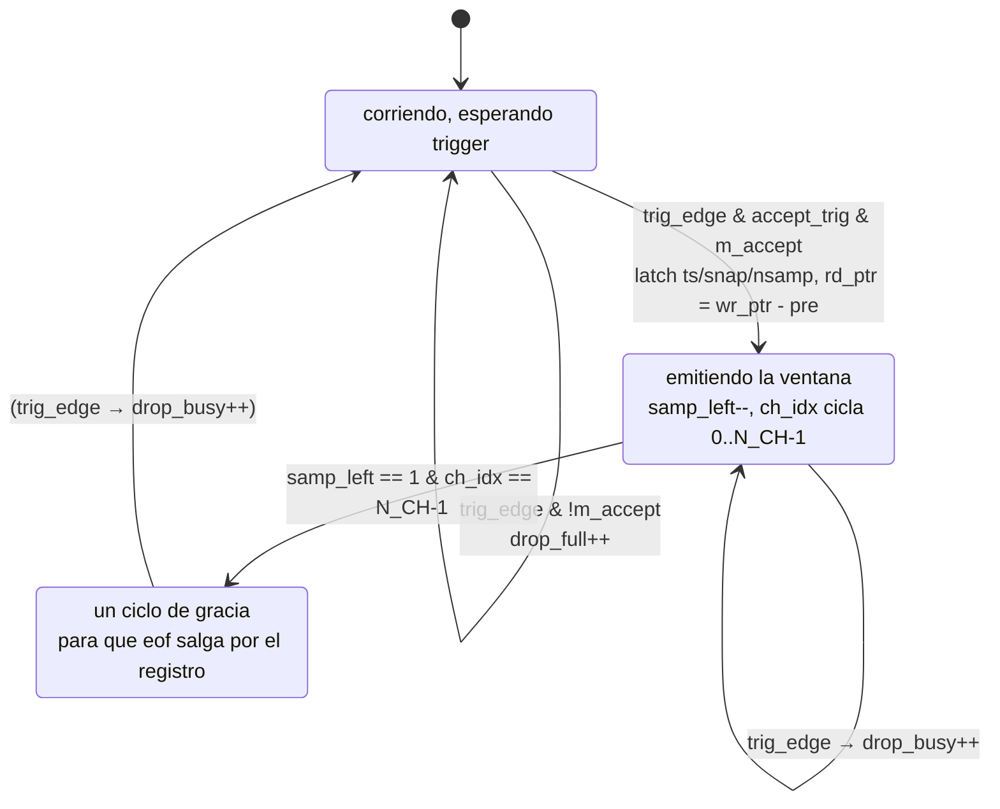
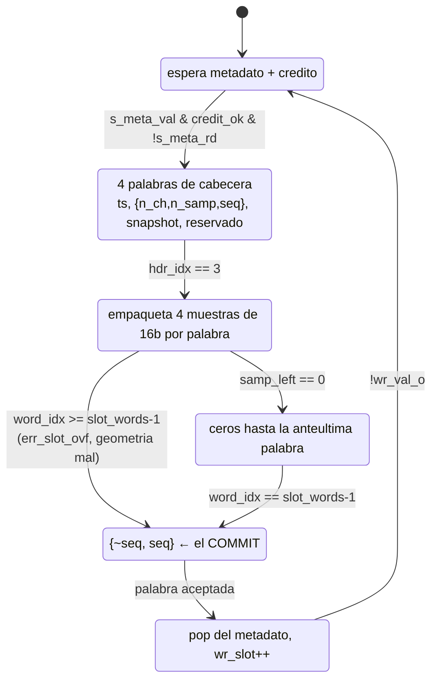
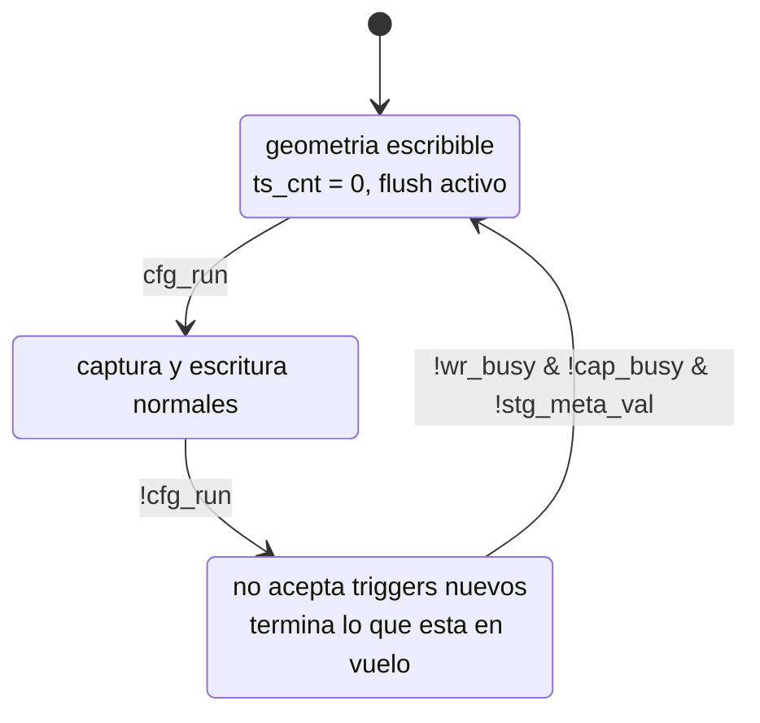

# La lógica de captura del `event_ring` — módulos, FSMs, créditos y AXI

Este documento explica **cómo funciona por dentro** el camino de captura que
reemplazó al ciclo arm/congelar/leer/re-armar: qué hace cada módulo, qué señala
cada señal, las tres FSMs involucradas, qué son exactamente los **créditos**, y
cómo se traducen los eventos en **transferencias AXI** hacia la DDR.

El *qué* y el *para qué* —mapa de registros, layout del slot, resultados de
validación— están en
[`diseno_y_register_map.md`](diseno_y_register_map.md). Acá está el *cómo*.

El punto de partida, la máquina que esto reemplaza, está descrito en
[`sistema_adquisicion_original.md`](../multitrigger/sistema_adquisicion_original.md).

---

## 1. El cambio de forma

El scope original resuelve un evento **congelando** el buffer y esperando que el
PS lo vacíe. Eso hace del PS parte del camino crítico: τ = 252.7 µs por evento,
`K = 1`, y —lo peor— la pérdida es **invisible**, porque no hay ningún contador
que registre los triggers que llegaron con la máquina ocupada.

El ring cambia la topología, no la velocidad de ningún bloque:

```
                         ┌── se frena ──┐     ┌── se frena ──┐
trigger ─► event_window_capture ─► event_stage_fifo ─► event_slot_writer
           (ventana pre+post)      (E eventos, BRAM)   (serializa el slot)
                    │                                          │
              descarta ENTERO                            axi_wr_fifo (256×64b)
              y CUENTA                                          │
                                                          axi_master (HP2, ID=3)
                                                                │
                                                               DDR
              wr_slot ────── comparador de créditos ────── rd_slot (lo publica el PS)
```

Tres propiedades que definen todo el diseño:

1. **La captura no se puede frenar.** Las muestras post-trigger llegan cuando
   llegan; no hay forma de pedirle al ADC que espere. Por eso el descarte tiene
   que ocurrir **arriba de todo**, en el instante del trigger.
2. **Todo lo de abajo sí se frena.** El writer espera créditos y espera al FIFO
   de AXI. La contrapresión sube por la cadena hasta la captura.
3. **Un evento entra entero o no entra.** Medio evento en la DDR sería
   indistinguible de uno bueno del lado del PS.

---

## 2. `event_window_capture` — de trigger a stream

Reemplaza el rol de `rp_bram_sm`. La diferencia estructural: en vez de congelar
16384 muestras, **copia** la ventana a un stream y vuelve a estar listo en
`(pre+post)·N_CH` ciclos, sin que el PS intervenga.

### 2.1 Señales

| señal | dir | qué es |
|---|---|---|
| `run_i` | in | mantiene vivo el pre-buffer y el drenaje |
| `accept_trig_i` | in | permite **aceptar** triggers nuevos |
| `pre_i` / `post_i` | in | muestras antes / desde el trigger (por canal) |
| `dat_i` / `dv_i` | in | muestras de los `N_CH` canales, ya calibradas |
| `trig_i` | in | trigger conjunto (se toma **por flanco**) |
| `snapshot_i` | in | 17 b: qué fuente disparó |
| `ts_i` | in | contador libre de 64 b, el reloj de la corrida |
| `m_val_o` / `m_dat_o` | out | una muestra de 16 b por ciclo |
| `m_sof_o` / `m_eof_o` | out | primera / última muestra del evento |
| `m_accept_i` | in | **se muestrea sólo en el ciclo del trigger** |
| `m_ts_o`, `m_snap_o`, `m_nsamp_o` | out | metadatos, válidos junto con el SOF |
| `drop_busy_o` / `drop_full_o` | out | pulsos, las dos causas de pérdida |

`run_i` y `accept_trig_i` están **separados a propósito**: en la parada ordenada
(`DRAINING`) se bajan los triggers nuevos pero se deja correr el drenaje, así la
parada no trunca la ventana en vuelo.

### 2.2 Por qué el trigger se toma por flanco

`multitrigger_trig_src` registra `adc_trig <= trig_comb`, o sea un **nivel**, y el
*strobe* que llega por el `sys_bus_cdc` puede durar más de un ciclo de `adc_clk`.
En la placa esto producía **dos eventos por cada trigger por software** (uno
capturado y uno contado como `drop_busy`). Se detecta flanco:

```verilog
wire trig_edge = trig_i && !trig_d;
```

Depender del ancho de un pulso generado por un módulo que no controlamos es
frágil; el flanco no. Regresión: `tb_event_window_capture` test [7].

### 2.3 Una sola memoria para el pre y el post

El pre-trigger vive en un buffer circular de `2^PRE_AW = 512` palabras que **se
escribe siempre** mientras `run_i`, pase lo que pase con la FSM de lectura. Si
dejara de escribirse durante el drenaje, el pre-trigger del evento siguiente
tendría un hueco.

La ventana **sale del mismo buffer**: al aceptar el trigger,

```verilog
rd_ptr <= wr_ptr - pre_i[PRE_AW-1:0];
```

y a partir de ahí se lee hacia adelante. Durante el "pre" hay datos de sobra;
durante el "post" el lector va detrás del escritor y consume lo que va llegando.
`rd_avail = (rd_ptr != wr_ptr)` es lo único que sincroniza las dos mitades.

> **El rezago crece, y hay un límite.** Con `N_CH` canales la salida serializa
> una muestra por ciclo, así que el lector consume **una palabra cada `N_CH`
> ciclos** mientras el escritor produce una por ciclo. El drenaje dura
> `T = (pre+post)·N_CH` ciclos y el rezago final es
>
> ```
> rezago = (pre + post)·N_CH − post        (= 2·pre + post  para N_CH = 2)
> ```
>
> Si ese número llegara a `2^PRE_AW`, el escritor pisaría datos que el lector no
> leyó todavía, **en silencio**. Con la geometría por defecto
> (`pre=8, post=24, N_CH=2`) da 40 contra 512: casi 13× de margen. Pero `S_AW=11`
> permite configurar ventanas de hasta 2047 muestras, y **el RTL no verifica esta
> condición**. Es el límite a respetar si se agrandan `PRE`/`POST`.

### 2.4 La FSM



El tiempo muerto **intrínseco del PL** es la duración de `ST_DRAIN` + `ST_TAIL`:

```
(pre + post)·N_CH + 1  ciclos  =  65 ciclos  =  520 ns   (S=32, N_CH=2, 125 MHz)
```

o sea un techo de ~1.9 Mev/s del lado del hardware, contra los 3.96 kev/s del
camino original. (La cabecera del módulo dice "~256 ns con S=32"; ese número
olvida el factor `N_CH` de la serialización. El valor correcto es 512 ns de
drenaje.)

### 2.5 El handshake de aceptación, y por qué es en el SOF

`m_accept_i` se muestrea **una sola vez**, en el ciclo del trigger. Si aguas abajo
no hay lugar para la ventana **completa**, el evento se descarta entero y se
cuenta como `drop_full`. Nunca se emite media ventana.

Ésta es la decisión que hace que los contadores signifiquen algo. La alternativa
—empezar a emitir y cortar si el consumidor se llena— dejaría en la DDR un
registro truncado que el PS no puede distinguir de uno bueno.

### 2.6 Las dos causas de pérdida, separadas

| contador | causa | qué decisión implica |
|---|---|---|
| `drop_busy` | el trigger cayó mientras se drenaba la ventana anterior | tiempo muerto del **PL**: bajar `pre+post`, o aceptar el techo |
| `drop_full` | aguas abajo no aceptó (stage llena, o sin créditos de DDR) | tiempo muerto del **consumidor**: el PS no drena, o el ring es chico |

Están separados porque llevan a acciones **opuestas**. Y su suma con `ev_cnt` es
el invariante que el sistema original no podía escribir:

```
EV_CNT + DROP_BUSY + DROP_FULL == triggers inyectados
```

### 2.7 Una sutileza que costó un off-by-one

En `ST_DRAIN`, al terminar de serializar una palabra:

```verilog
if (ch_idx == N_CH-1) begin
  ch_idx    <= '0;
  samp_left <= samp_left - 1'b1;
  word_val  <= do_read;        // <-- NO 1'b0
```

`do_read` puede dispararse en **ese mismo ciclo** (`want_word` lo permite cuando
`ch_idx == N_CH-1`). Si acá se forzara `0` a secas, el `word_val <= 1` de la rama
de lectura quedaría pisado y se perdería la palabra recién cargada: una muestra
menos por evento, silenciosamente.

---

## 3. `event_stage_fifo` — el buffer elástico

Existe porque la captura no se frena y el writer sí. Con capacidad para `E = 4`
eventos, la captura puede empezar el evento N+1 mientras el writer todavía drena
el N.

**Dos colas en paralelo**, y ésa es la idea central:

- **muestras**: BRAM de `2^DATA_AW = 4096` palabras de 16 b, con lectura
  registrada (el dato sale el ciclo **después** del pop; el writer lo compensa con
  su registro `rd_d`);
- **metadatos**: `E` entradas en registros (`ts`, `snapshot`, `nsamp`).

El writer las consume **desacopladas**: primero lee el metadato para armar la
cabecera, después drena las muestras.

### El metadato se publica en el EOF, no en el SOF

```verilog
if (s_val_i && s_sof_i) meta_open <= 1'b1;          // se escribe
if (s_val_i && s_eof_i) begin meta_wr <= meta_wr + 1; end  // recién acá cuenta
assign m_meta_val_o = (meta_lvl != 0);
```

Si el evento se ofreciera al writer en el SOF, el writer podría drenar la cola de
muestras **más rápido de lo que entran** y leer basura. `meta_lvl` cuenta sólo
eventos **completos**; `meta_open` marca el que está a medio entrar y cuenta para
la ocupación, pero no para la disponibilidad.

### `s_accept_o` — la promesa

```verilog
assign s_accept_o = (free32 >= winlen32) && !meta_full;
```

Es la respuesta a "¿entra una ventana **entera**?", y es lo que la captura
consulta en el ciclo del trigger. Las comparaciones están ensanchadas a 32 bits a
propósito: con las anchuras nativas, la relación entre `DATA_AW` y `S_AW` depende
de la parametrización y el *zero-extend* puede quedar de ancho negativo (no
compila) o, peor, truncar en silencio.

---

## 4. `event_slot_writer` — de evento a slot

Emite **exactamente** `2^(slot_shift−3)` palabras de 64 b por evento, en orden de
dirección creciente. El layout está en
[`diseno_y_register_map.md`](diseno_y_register_map.md#layout-del-slot).

### 4.1 La FSM



### 4.2 El empaquetado

Cuatro muestras de 16 b por palabra de 64, entrando por arriba:

```verilog
acc <= {s_dat_i, acc[63:16]};
```

La primera muestra queda en `[15:0]` — *little-endian*, para que el PS haga un
`np.frombuffer(..., '<i2')` directo, sin reordenar nada. Si la ventana no es
múltiplo de 4, la última palabra se completa con ceros por el mismo camino.

El pipeline es de un ciclo: `s_dat_rd_o` pide, `rd_d` marca que el dato del stage
ya está disponible. Esa asimetría es la que obliga a los tres caminos del `case`
de `W_DATA` (emitir, absorber, pedir).

### 4.3 Dos guardas que no son opcionales

**`!s_meta_rd_o` en `W_IDLE`.** El pop del metadato anterior recién se refleja en
`s_meta_val_i` un ciclo **después**. Sin el guard, al volver de `W_DONE` se lee el
**mismo** evento y se escribe dos veces — y un slot duplicado es indistinguible de
uno legítimo del lado del PS.

**`err_slot_ovf_o`.** Si la cabecera + los datos pasan de la anteúltima palabra,
la ventana no entra en el slot configurado. Se levanta un *sticky*, se **trunca**
el evento y se cierra el slot con su footer. Preferible a pisar el slot siguiente
en silencio.

### 4.4 Sin créditos el writer **se frena**, no descarta

```verilog
if (s_meta_val_i && credit_ok_i && !s_meta_rd_o) ...
```

La contrapresión sube al stage, y de ahí a la captura, que descarta el evento
**entero** y lo cuenta. Descartar a mitad de slot dejaría basura en la DDR.

---

## 5. Los créditos

Ésta es la pieza que reemplaza al "arm/congelar/re-armar", así que vale la pena
ser explícito.

### 5.1 Qué es un crédito acá

Un crédito es **un slot libre en el ring de DDR**. El productor (el PL) sólo
escribe si tiene al menos uno; el consumidor (el PS) los devuelve avisando hasta
dónde leyó.

En vez de un *flag* de "lleno" —que exigiría comunicación en ambos sentidos por
evento— cada lado lleva **un contador monótono que nunca se resetea**:

- `wr_slot`: slots que el PL **escribió** (lo incrementa el writer al cerrar cada
  slot);
- `rd_slot`: slots que el PS **consumió** (lo publica el PS por el registro
  `0x24`).

Y la ocupación es una resta:

```verilog
wire [31:0] occupied  = wr_slot - rd_slot;
wire        credit_ok = (occupied < n_slots);
```

### 5.2 Por qué contadores libres y no punteros módulo N

Podría hacerse con punteros que envuelven en `N_SLOTS`, pero entonces
`wr == rd` significa a la vez "vacío" y "lleno" y hay que sacrificar un slot o
llevar un bit extra. Con contadores libres de 32 bits:

- la **resta en módulo 2³²** da la ocupación correcta aunque los dos contadores
  hayan dado vueltas, siempre que `N_SLOTS < 2³¹`;
- `N_SLOTS` puede ser cualquiera, no hace falta potencia de 2;
- lleno y vacío son distinguibles sin trucos.

La dirección física se deriva aparte, por aritmética pura:

```
dirección = SLOT_BASE + (wr_slot mod N_SLOTS) · SLOT_SZ
```

### 5.3 Los créditos se devuelven **por lote**

El PS publica `rd_slot` **una vez por batch**, no por evento. Publicarlo por
evento devolvería el bus GP0 al camino crítico, que es exactamente lo que este
diseño está sacando de ahí. Un batch de 128 slots devuelve 128 créditos con una
sola escritura.

### 5.4 Los tres contadores se reinician JUNTOS

`wr_slot`, `rd_slot` y el generador de direcciones del `axi_wr_fifo` cuelgan
todos de `flush`. No es cosmético; los dos modos de falla aparecieron en la placa:

- resetear `wr_slot` **sin** `rd_slot` deja `occupied = wr − rd` en *underflow*
  (~2³²) ⇒ `credit_ok = 0` ⇒ **el ring descarta todo**;
- hacer que los contadores sobrevivan al stop **sin** resetear la dirección del
  FIFO deja el índice desincronizado de la memoria ⇒ el PS lee el slot
  equivocado.

Por eso `flush_i` y `clr_cnt_i` están separados en el writer, y el top los
maneja como pareja.

### 5.5 El segundo sistema de créditos: la sombra del `axi_wr_fifo`

Hay un control de flujo más, independiente del anterior, y por una razón
incómoda: **`axi_wr_fifo` no expone su nivel de llenado y descarta en silencio si
se empuja estando lleno** (sólo levanta `stat_overflow_o`). Así que el top lleva
su propia cuenta:

```verilog
wire fifo_push = wr_val_o && wr_rdy;
wire fifo_pop  = axi_wvalid_o && axi_wrdy_i;
assign wr_rdy  = (fifo_occ < (FIFO_N - 8));
```

Entre el pop interno del FIFO y la aceptación por el master hay una palabra en
vuelo (`data_in_reg`), así que esta cuenta **sobreestima** la ocupación real. Es
deliberado: sobreestimar frena de más, subestimar corrompe. El margen de 8
palabras cubre las que puedan estar dentro del master.

`err_fifo_ovf` es *sticky* sobre `stat_overflow_o`: si alguna vez se dispara, la
sombra tiene un bug y lo que hay en DDR es basura. Tiene que ser visible.

### 5.6 Resumen del control de flujo

| nivel | recurso | señal | qué pasa al agotarse |
|---|---|---|---|
| 1 | slots de DDR | `credit_ok` | el writer **se frena** en `W_IDLE` |
| 2 | `axi_wr_fifo` | `wr_rdy` | el writer **se frena** a mitad de slot |
| 3 | stage (muestras + metadatos) | `s_accept` | la captura **descarta entero** → `drop_full` |
| 4 | la captura misma | `busy` | trigger durante el drenaje → `drop_busy` |

Los niveles 1 y 2 **frenan**; los 3 y 4 **descartan y cuentan**. Que el descarte
ocurra sólo arriba, donde se puede descartar un evento completo, es lo que hace
que los contadores sean exactos.

---

## 6. El camino AXI

### 6.1 Lo primero: la interfaz del ring **no es AXI**

`event_ring_top` no habla AXI. Habla la interfaz simplificada de escritura de
Instrumentation Technologies —`waddr / wdata / wsel / wlen / wfixed / wvalid /
wrdy`— la misma que usa `rp_axi_sm` en el scope original. Hay dos traducciones en
el medio:

```
event_slot_writer          axi_wr_fifo              axi_master              PS/DDR
  palabras de 64 b   ──►   agrupa en rafagas  ──►   canales AW/W/B    ──►   HP2
  con wr_val/wr_rdy        y genera direcciones     de AXI3 de verdad
```

- **`axi_wr_fifo`** ([`rtl/classic/axi_wr_fifo.v`](../../../../rtl/classic/axi_wr_fifo.v))
  convierte un flujo de palabras en **ráfagas** con dirección: decide cuándo
  arrancar una, de qué largo, y lleva el puntero de escritura con envolvimiento.
- **`axi_master`** ([`rtl/classic/axi_master.v`](../../../../rtl/classic/axi_master.v))
  convierte eso en los canales AXI reales (`AW`, `W`, `B`) contra el puerto HP2
  del PS.

Reusar los dos bloques tal cual —sin tocarlos— fue una decisión explícita: son RTL
compartido con el resto del árbol, y el camino de *deep memory* del scope ya los
ejercita en producción.

### 6.2 Cómo se forman las ráfagas

El FIFO tiene `2^FW = 256` entradas de 64 b (2 KB). Arranca una ráfaga cuando

```verilog
assign new_burst = (((fifo_flush && axi_wrdy_i) || (fill_lvl >= sys_trig_size_r))
                    && !dat_cnt && |fill_lvl || single_burst_posedge) && !clear_do;
```

o sea: hay al menos `ctrl_trig_size_i` palabras acumuladas, o el flujo se cortó y
hay que vaciar lo que quedó (`fifo_flush`), o quedó **una sola** palabra atrapada
en el registro de salida (`single_burst`).

El ring pasa **`ctrl_trig_size_i = 4'hF`**, el mismo valor que producción
([`rp_axi_sm.v:246`](../../../../rtl/classic/rp_axi_sm.v#L246)). No es un número
arbitrario: con un umbral más bajo el FIFO arranca ráfagas cortas y **repite el
último beat** cuando se queda sin datos a mitad de ráfaga.

El largo (`axi_wlen_o`, que es `AWLEN`) sale de un cálculo con tres cotas
([`axi_wr_fifo.v:216-245`](../../../../rtl/classic/axi_wr_fifo.v#L216)):

| cota | expresión | qué evita |
|---|---|---|
| datos disponibles | `fill_lvl[3:0]` | prometer beats que no existen |
| frontera de alineación | `4'hF - next_address[6:3]` | cruzar un bloque de 128 B |
| dirección de fin | `sys_stop_addr_r[6:3] - next_address[6:3]` | pasarse del ring |

La segunda merece un comentario, porque es la que satisface la **regla de las
4 KB de AXI** (una ráfaga no puede cruzar un límite de 4096 B). Acá se resuelve
por construcción y con margen: las ráfagas se alinean a bloques de **128 bytes**
(16 beats × 8 B), así que ninguna puede cruzar 4 KB. No hace falta ninguna
comprobación adicional.

Máximo por ráfaga: **16 beats × 8 B = 128 B**. Un slot de 512 B son **4 ráfagas**.

El envolvimiento del ring es explícito
([`:283`](../../../../rtl/classic/axi_wr_fifo.v#L283)):

```verilog
else if (ctrl_wrap_i && new_burst && (axi_waddr_o == sys_stop_addr_r)) begin
   next_address <= sys_start_addr_r + DW/8 ;
   axi_waddr_o  <= sys_start_addr_r ;
```

> **`stop_addr` es INCLUSIVO**: el FIFO envuelve *cuando* `axi_waddr_o ==
> stop_addr`, o sea que **escribe** en esa dirección antes de volver al
> principio. Por eso el top pasa `slot_base + ring_sz − 8`. Sin el `−8` el ring
> pisa la primera palabra que sigue a la región reservada.

### 6.3 Qué sale realmente por el bus

`axi_master` está instanciado para HP2 con `ID = 3`, `DW = 64`, `LW = 4`
([`red_pitaya_ps.sv:234`](../../rtl/red_pitaya_ps.sv#L234)). Eso fija:

| señal AXI | valor | de dónde sale |
|---|---|---|
| `AWSIZE` | `3'b011` = **8 bytes/beat** | `USE_SZ=0` ⇒ `{(DW==512),1'b1,(DW==64)}` |
| `AWBURST` | `2'b01` = **INCR** | `awburst[0] = !sys_wfixed`, y el ring pide `wfixed=0` |
| `AWLEN` | 0…15 | el cálculo de §6.2 |
| `AWID` / `WID` | **3, constante** | parámetro `ID` |
| `AWCACHE` | `4'b0011` | **no cacheable**, bufferable |
| `AWPROT` | `3'b000` | dato, no privilegiado |
| `AWLOCK` | `2'b00` | normal |

Dos consecuencias que el diseño usa:

**(a) `AWCACHE = 0011` — no cacheable.** Las escrituras no pasan por la cache del
ARM. El lado del PS **tiene que mapear la región con `O_SYNC`** (mapeo no
cacheable) o vería datos viejos. Es un requisito del esquema del footer, no una
optimización.

**(b) `AWID` constante.** Todas las escrituras del ring salen con el **mismo ID**
hacia el **mismo esclavo**. AXI garantiza que las transacciones con igual ID y
mismo destino se observan **en orden**. Ése es todo el fundamento del commit por
footer.

Dentro del master hay dos FIFOs de 16 entradas (direcciones y datos) y la
contrapresión hacia el FIFO de escritura sale de

```verilog
sys_wrdy_o <= ~&axi_wfill_lvl[3:1] && ~&axi_awfill_lvl[3:1];
```

es decir, se corta cuando **cualquiera** de los dos se acerca a lleno.

Ancho de banda: una palabra de 8 B por ciclo a 125 MHz ⇒ **1 GB/s** de techo. Un
slot de 512 B son 64 ciclos, que es **exactamente** lo que tarda la captura en
drenar una ventana de 32 muestras × 2 canales. Los dos lados del writer están
balanceados por construcción; el ring usa ~5 % de la DDR a tasas realistas.

### 6.4 Por qué el commit es un footer y no el `BRESP`

El plan original decía "incrementar `wr_slot` recién con el `BRESP` del último
burst". Es correcto en teoría e **inaplicable** acá: ni `axi_wr_fifo` ni
`axi_master` exponen el canal B. El master pone `axi_bready_o = 1'h1` fijo y usa
la respuesta **sólo** para levantar un `sys_werr_o`
([`axi_master.v:284-292`](../../../../rtl/classic/axi_master.v#L284)):

```verilog
assign axi_bready_o = 'h1 ;
sys_werr_o <= axi_bvalid_i && (axi_bresp_i == 2'h2) ;
```

No hay forma de saber **a qué transacción** corresponde una respuesta sin tocar
RTL compartido con otros proyectos.

La solución estándar de *descriptor ring* es además más barata: **una marca al
final del slot**.

```verilog
W_FOOT: wr_dat_o <= {~seq_o, seq_o};
```

Por el argumento de ordenamiento de (b): si el PS ve el footer del slot con el
`seq` esperado, **todo lo que está antes ya está en DDR**. El footer *es* el
commit.

El valor `{~seq, seq}` permite detectar una lectura vieja o rota comparando las
dos mitades, sin depender de que "0" sea un valor especial (que en un ring recién
limpiado no lo es).

**La ventaja grande es del lado del PS**: no necesita leer **ningún** registro por
GP0 en el lazo caliente. Polea el footer del próximo slot directamente en DDR, lo
que es más rápido que una lectura de registro (2.3 µs) y saca el bus GP0 del
camino crítico por completo. `WR_SLOT` queda como diagnóstico.

### 6.5 Por qué slots de tamaño fijo y relleno con ceros

Escribir 43 palabras de ceros por evento (con `SLOT_SZ=512 B` y `S=32`: 4 de
cabecera + 16 de datos + 43 de relleno + 1 de footer) parece un desperdicio. Lo
es, y se paga a propósito. Las razones, en orden de peso:

1. **El generador de direcciones del `axi_wr_fifo` es un incrementador lineal.**
   No sabe saltar ni buscar: `next_address <= next_address + DW/8`. Cualquier
   layout tiene que ser un **flujo lineal de bytes**. Un slot de largo variable
   exigiría reescribir ese bloque.
2. **La dirección se calcula, no se consulta.** Con tamaño fijo, ambos lados
   derivan `base + (slot mod N)·SZ` con aritmética pura. El PS puede saltar
   directamente al slot que quiere mirar **sin leer nada** — que es lo que hace
   el poleo del footer.
3. **Acceso aleatorio y descarte.** Con registros de largo variable habría que
   parsear secuencialmente desde el principio; perder un slot arruinaría el resto
   del ring.
4. **El costo no existe.** El ancho de banda sobra por un factor grande, y las
   ráfagas alineadas a 128 B son más eficientes que ráfagas cortas de largo
   irregular.

Es la misma economía de los *descriptor rings* de una NIC: se paga memoria y
ancho de banda para que la sincronización sea aritmética en vez de mensajes.

### 6.6 El dominio de reloj de HP2

HP2 se movió a `adc_clk` (125 MHz):

```systemverilog
axi_sys_if axi2_sys (.clk(adc_clk), .rstn(adc_rstn));
```

Antes colgaba de `dac_axi_clk` (250 MHz) porque era del ASG. Dejarlo así habría
sido un **cruce de dominios sin sincronizar** sobre `wvalid`/`wrdy`: datos
corruptos sin ningún síntoma visible. El ASG ya no existe, HP2 es de uso
exclusivo del ring, y ahora es coherente con `axi0`/`axi1`, que ya usaban
`adc_clk`.

Con eso, **todo el ring vive en un solo dominio**: captura, writer, registros y
AXI. No hace falta ningún CDC ni codificación Gray entre `WR_SLOT` y `RD_SLOT`.
El bus de sistema llega ya sincronizado a `adc_clk` por el `sys_bus_cdc`.

---

## 7. La FSM global y el bus de registros



`G_DRAINING` existe para no cortar un slot por la mitad. Es el estado que hace
que `run_i` y `accept_trig_i` tengan que estar separados en la captura.

**La geometría se congela en `STOPPED`.** `SLOT_BASE`, `RING_SZ`, `SLOT_SHIFT`,
`PRE` y `POST` sólo latchean con la adquisición parada; escribirlos corriendo se
**ignora** y levanta `err_cfg` (*sticky*). Así nunca conviven dos geometrías en el
mismo ring.

**El `ack` es de latencia fija e incondicional:**

```verilog
ack_sr  <= {ack_sr[2:0], (sys_wen || sys_ren)};
sys_ack <= ack_sr[2];
```

Ninguna ruta de `ack` depende de un sub-bloque, así que ningún estado interno
puede colgar el slot del bus. Es la lección directa del bug latente de
`bram_ack[2]/[3]` en el scope
([`sistema_adquisicion_original.md` §4](../multitrigger/sistema_adquisicion_original.md#4-rp_acq_bram--el-buffer-y-su-lectura),
[`bus_sistema_redpitaya.md` §7.1](../bus_sistema_redpitaya.md)).

---

## 8. Modos de falla y cómo se ven

| síntoma | registro | causa probable |
|---|---|---|
| `drop_busy` crece | `0x30` | tasa por encima del techo del PL: `(pre+post)·N_CH` ciclos por evento |
| `drop_full` crece | `0x34` | el PS no drena, o `RING_SZ` es chico. Mirar `no_credit` |
| `no_credit` = 1 | `0x04[4]` | el writer está frenado esperando que el PS publique `RD_SLOT` |
| `err_cfg` = 1 | `0x04[5]` | se intentó escribir geometría con la adquisición corriendo |
| `err_slot_ovf` = 1 | `0x04[6]` | `SLOT_SHIFT` demasiado chico para `PRE+POST`: eventos truncados |
| `err_fifo_ovf` = 1 | `0x04[7]` | la sombra de ocupación del `axi_wr_fifo` falló ⇒ **datos en DDR corruptos** |
| todo se descarta desde el arranque | `WR_SLOT`/`RD_SLOT` | *underflow* de créditos: se reinició uno sin el otro |
| el PS lee slots viejos | — | la región no se mapeó con `O_SYNC` (§6.3a) |

---

## 9. Referencias

- [`diseno_y_register_map.md`](diseno_y_register_map.md) — mapa de registros,
  layout del slot, resultados de la validación en placa y estado de *timing*.
- [`salida_por_red.md`](salida_por_red.md) — qué hace el PS con los slots.
- [`../multitrigger/sistema_adquisicion_original.md`](../multitrigger/sistema_adquisicion_original.md)
  — la máquina que esto reemplaza.
- [`../bus_sistema_redpitaya.md`](../bus_sistema_redpitaya.md) — el bus, el CDC y
  el contrato del `ack`.
- [`../../software/tests/tiempo-muerto/README.md`](../../software/tests/tiempo-muerto/README.md)
  — los modelos de tiempo muerto y las mediciones.
- RTL: [`event_window_capture.sv`](../../rtl/mine/event_ring/event_window_capture.sv),
  [`event_stage_fifo.sv`](../../rtl/mine/event_ring/event_stage_fifo.sv),
  [`event_slot_writer.sv`](../../rtl/mine/event_ring/event_slot_writer.sv),
  [`event_ring_top.sv`](../../rtl/mine/event_ring/event_ring_top.sv).
- AXI: `AMBA AXI3/AXI4 Protocol Specification` (ARM IHI 0022) — §A3.4 para el
  ordenamiento por ID, §A3.4.1 para la regla de las 4 KB.
