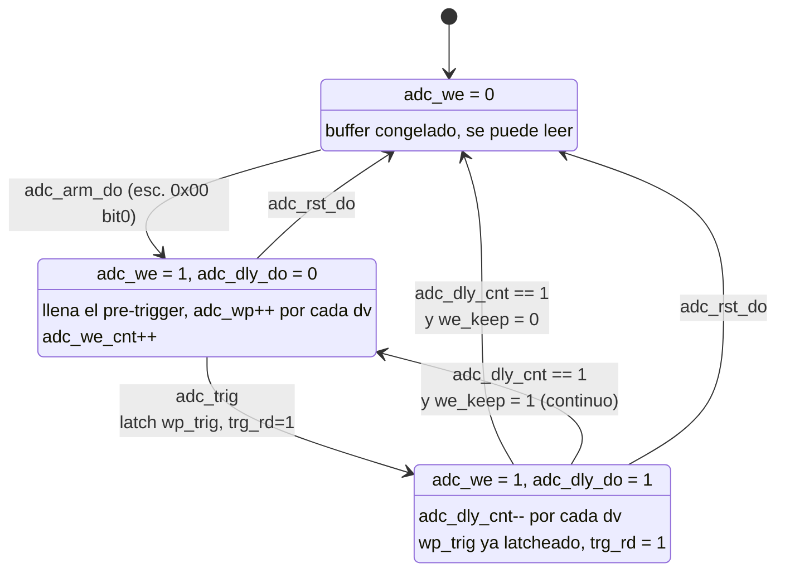

# El sistema de adquisición original (`rp_scope_com`) — anatomía a nivel de señales

Este documento describe **cómo adquiere el osciloscopio stock de Red Pitaya**: la
cadena de acondicionamiento, cómo se fabrica el trigger, la FSM que arma/congela
el buffer (`rp_bram_sm`), cómo se lee la BRAM por el bus, y el camino paralelo a
DDR (`rp_axi_sm`).

Es la **línea de base** de la que descienden el multitrigger y el
[`event_ring`](../event_ring/logica_de_captura_y_axi.md). Entender esta máquina
es lo que explica por qué el ciclo por evento es `K=1` con τ = 252.7 µs, y qué
había que cambiar.

Todo el RTL citado está en [`rtl/classic/`](../../../../rtl/classic/) (la copia
para 250 MSPS, idéntica en esta parte, está en `rtl_250/classic/`).

---

## 1. Panorama

`rp_scope_com` es un contenedor: no tiene lógica propia más allá del cableado.
Instancia, **por canal** (`generate` sobre `GV < N_CH`), la cadena completa, y
una sola vez los bloques compartidos.

```
                 rp_scope_calib   osc_filter    rp_decim      rp_delay
ADC ch0 (14b) ──► offset+gain ──► IIR 4 coef ──► dec/avg ──┬─► +1/+2 muestras ──┬─► adc_bram_in
   125 MSPS                                                │                     └─► axi_ram_in
                                                           │
                                                           ├─► rp_adc_trig ──► adc_trig_p/n
                                                           │   (Schmitt+hyst)
                                                           ▼
                                          rp_trig_src ──► adc_trig  (1 ciclo)
                                        (mux 4b + protect)     │
                                                               ├──► rp_bram_sm ──► adc_we, adc_wp,
                                                               │                   adc_wp_trig, adc_dly_do
                                                               │                        │
                                                               │                        ▼
                                                               │                   rp_acq_bram (16384×14b)
                                                               │                        │
                                                               │                   lectura por el bus
                                                               │
                                                               └──► rp_axi_sm ──► axi_wr_fifo ──► HP ──► DDR
```

| bloque | archivo | rol |
|---|---|---|
| `rp_scope_calib` | [`rp_scope_com.v:199`](../../../../rtl/classic/rp_scope_com.v#L199) | offset + ganancia de calibración |
| `osc_filter` | [`:219`](../../../../rtl/classic/rp_scope_com.v#L219) | ecualizador IIR (coef. `aa/bb/kk/pp`), *bypass* por `set_filt_byp` |
| `rp_decim` | [`:250`](../../../../rtl/classic/rp_scope_com.v#L250) | diezmado 1…65536, con o sin promedio |
| `rp_delay` | [`:269`](../../../../rtl/classic/rp_scope_com.v#L269) | alinea el dato con el trigger que ese dato produjo |
| `rp_adc_trig` | [`:292`](../../../../rtl/classic/rp_scope_com.v#L292) | comparador Schmitt → pulsos `trig_p` / `trig_n` |
| `rp_trig_src` | [`:309`](../../../../rtl/classic/rp_scope_com.v#L309) | selector de fuente + *trigger protect* |
| **`rp_bram_sm`** | [`:340`](../../../../rtl/classic/rp_scope_com.v#L340) | **la FSM de captura** |
| `rp_acq_bram` | [`:366`](../../../../rtl/classic/rp_scope_com.v#L366) | la BRAM de 16384 muestras y su puerto de lectura |
| `rp_axi_sm` | [`:386`](../../../../rtl/classic/rp_scope_com.v#L386) | camino paralelo a DDR (*deep memory*) |
| `rp_ext_trig` | [`:458`](../../../../rtl/classic/rp_scope_com.v#L458) | *debounce* del trigger externo y del ASG |
| `rp_scope_cfg` | [`:477`](../../../../rtl/classic/rp_scope_com.v#L477) | registros, pulsos de comando, mux de lectura |

**Un solo dominio de reloj.** `axi_clk = adc_clk_i` y `axi_rstn = adc_rstn_i`
([`:545`](../../../../rtl/classic/rp_scope_com.v#L545)): a pesar del nombre, el
camino AXI corre en el reloj del ADC.

---

## 2. La cadena de datos, señal por señal

### 2.1 `dec_val` — el latido que todo lo gobierna

`rp_decim` no produce un dato por ciclo: produce **`dec_val_o` cada `set_dec`
ciclos**. Ese pulso, propagado como `adc_dv_del` → `adc_dv_bram`, es el que
habilita *todas* las cuentas aguas abajo: el puntero de escritura, el contador de
pre-trigger y el contador de post-trigger. En diezmado 1 vale cada ciclo (8 ns);
en diezmado 8, uno de cada ocho.

Con promedio activo y `set_dec ≥ 16`, `rp_decim` usa un divisor con ~33 ciclos de
latencia ([`rp_decim.v:58`](../../../../rtl/classic/rp_decim.v#L58)) y la ruta de
datos válida pasa a ser `adc_dv_div`. Las potencias de 2 hasta 8 se resuelven con
un *shift* ([`:141-146`](../../../../rtl/classic/rp_decim.v#L141)), y los factores
que no son potencia de 2 y son < 16 **no promedian**: sólo submuestrean
([`:147-157`](../../../../rtl/classic/rp_decim.v#L157)).

### 2.2 `rp_delay` — por qué existe

El comparador de trigger mira `adc_dly_in`, la salida **cruda** del diezmador; la
BRAM guarda `dly_dat_o`, la salida **retrasada**. La razón es que fabricar el
trigger cuesta ciclos: `rp_adc_trig` tiene dos etapas de registro
([`rp_adc_trig.v:53-63`](../../../../rtl/classic/rp_adc_trig.v#L53)) y
`rp_trig_src` agrega una más ([`rp_trig_src.v:86`](../../../../rtl/classic/rp_trig_src.v#L86)).
Si el dato no se retrasara, `adc_wp_trig` apuntaría varias muestras **después**
de la que cruzó el umbral.

El retraso se elige según la **última fuente configurada**
([`rp_delay.v:89-104`](../../../../rtl/classic/rp_delay.v#L89)):

| `last_src` | fuente | `dat_dly` |
|---|---|---|
| 2,3,4,5,10…13 | flanco de ADC (nivel) | 1 |
| 6,7,8,9 | externo / ASG | 2 |
| otro | manual (SW) | conserva el anterior (`prev_dly`) |

El caso *manual* es sutil: el trigger por software no tiene una latencia física
que compensar, así que **hereda el retraso de la última fuente real**. Cambiar de
fuente y volver a SW deja un retraso que no corresponde a nada — no rompe nada,
pero desplaza el `wp_trig` un par de muestras.

### 2.3 El trigger: `rp_adc_trig`

Un Schmitt de dos umbrales calculados una vez por ciclo
([`:49-50`](../../../../rtl/classic/rp_adc_trig.v#L49)):

```verilog
set_treshp <= set_tresh_i + set_hyst_i ;   // rearme del flanco negativo
set_treshm <= set_tresh_i - set_hyst_i ;   // rearme del flanco positivo
```

`adc_scht_p[0]` se pone en 1 cuando el dato cruza `set_tresh` hacia arriba y sólo
vuelve a 0 cuando baja de `set_tresh − hyst`. La salida es un **pulso de un
ciclo**, obtenido por detección de flanco sobre ese biestable
([`:62`](../../../../rtl/classic/rp_adc_trig.v#L62)):

```verilog
adc_trig_p_o <= adc_scht_p[0] && !adc_scht_p[1] ;
```

La histéresis es lo único que impide que el ruido sobre el umbral genere una
lluvia de triggers. Los dos comparadores (`p` y `n`) corren siempre, en paralelo,
para los cuatro canales del sistema; quién dispara de verdad lo decide el
siguiente bloque.

### 2.4 La selección de fuente y el *trigger protect*: `rp_trig_src`

Tres mecanismos en 130 líneas, y los tres importan:

**a) El mux.** `set_trig_src` es un código de 4 bits (no una máscara), decodificado
en un `case` ([`:87-102`](../../../../rtl/classic/rp_trig_src.v#L87)). Ésta es la
diferencia estructural con el multitrigger, que reemplaza el `case` por una
OR-máscara y por eso puede aceptar varias fuentes a la vez.

**b) Auto-limpieza (*single shot*).** Al disparar, la fuente se borra sola:

```verilog
if (set_trg_new_i)                                 set_trig_src <= set_trg_src_i ;
else if (adc_dly_do_i || adc_trig || adc_rst_do_i) set_trig_src <= 4'h0 ;
```

**c) *Trigger protect*.** `adc_trg_dis` se engancha con el primer trigger y
enmascara la fuente (`set_trig_src & {4{!adc_trg_dis}}`) hasta que el software lo
limpia escribiendo el registro `0x94`. Es lo que garantiza que un segundo evento
no pise `adc_wp_trig` antes de que el PS lo lea.

> **El race de orden.** Estos dos enganches se arman **apenas se carga la
> máscara**, sin esperar a que la FSM de captura esté armada. Con señal viva, un
> flanco entre "cargar la fuente" y "armar" gasta el disparo y deja la FSM
> esperando para siempre. Es exactamente el bug documentado en
> [`orden_arm_trigger_captura.md`](orden_arm_trigger_captura.md), y la razón de la
> convención **armar → habilitar fuente**.

También hay un detalle de sincronismo en el trigger por software
([`:57`](../../../../rtl/classic/rp_trig_src.v#L57)):

```verilog
assign adc_trig_sw = (adc_trig_sw_r) && dly_valp_i;
```

El pulso del bus se **estira** hasta que llega la próxima muestra válida
(`dly_valp_i`). Sin eso, con diezmado alto el trigger por software caería entre
muestras y no se contaría en ningún lado.

---

## 3. `rp_bram_sm` — la FSM de captura

Es el corazón del sistema, y lo primero que hay que decir es que **en el RTL no
hay ninguna máquina de estados explícita**: no existe un `case (state)`. Hay
cuatro bloques `always` independientes con banderas que se enganchan entre sí. El
"estado" es implícito, y vive en el par `(adc_we, adc_dly_do)`.

### 3.1 Las señales

| señal | ancho | qué es |
|---|---|---|
| `adc_we` | 1 | **escritura habilitada**. Mientras vale 1 el buffer se llena; cuando cae, el buffer queda *congelado* |
| `adc_dly_do` | 1 | estamos **dentro del retardo post-trigger** |
| `adc_dly_cnt` | 32 | cuenta regresiva de muestras post-trigger |
| `adc_dly_end` | 1 | *sticky*: el retardo terminó (se borra sólo con arm/reset) |
| `adc_trg_rd` | 1 | *sticky*: **hubo trigger** (se borra sólo con arm/reset) |
| `adc_wp` | 14 | puntero de escritura, envuelve solo en 16384 |
| `adc_wp_cur` | 14 | copia registrada de `adc_wp`, es lo que lee el SW en `0x18` |
| `adc_wp_trig` | 14 | `adc_wp` **latcheado en el trigger** → `0x1C` |
| `adc_we_cnt` | 32 | muestras escritas **antes** del trigger → `0x2C` |

Los tres punteros son de `RSZ=14` bits: el envolvimiento del buffer circular es
la aritmética natural del registro, no hay comparación con un tope.

### 3.2 Los enganches, uno por uno

**`adc_we`** ([`:65-68`](../../../../rtl/classic/rp_bram_sm.v#L65)):

```verilog
if (adc_arm_do_i)
  adc_we <= 1'b1 ;
else if (((adc_dly_do || adc_trig_i) && (adc_dly_cnt == 32'h1) && ~adc_we_keep_i) || adc_rst_do_i)
  adc_we <= 1'b0 ;
```

Se arma por comando y **se apaga solo** cuando la cuenta regresiva llega a 1 — a
menos que `adc_we_keep_i` esté puesto, que es el modo continuo: ahí nunca
congela.

> **`set_dly = 0` es un caso degenerado, no un "sin retardo".** El contador se
> recarga con `set_dly_i` mientras `!adc_dly_do`, así que arranca en 0 y **nunca
> pasa por el valor 1**. La condición de apagado no se cumple jamás: `adc_we`
> queda en 1 para siempre y el buffer no se congela. Por eso todo el software del
> proyecto usa `delay ≥ 1`.

**`adc_wp_trig`** ([`:91`](../../../../rtl/classic/rp_bram_sm.v#L91)):

```verilog
else if (adc_trig_i && !adc_dly_do)
  adc_wp_trig_o <= adc_wp_o;
```

El `!adc_dly_do` es lo que hace que **el primer trigger gane**: los que llegan
mientras se completa el post-trigger no pisan la marca. Nótese que la condición
**no incluye `adc_we`**: si llega un trigger con la FSM desarmada y `adc_dly_do`
en 0, `wp_trig` se actualiza igual con un puntero que no significa nada.

**`adc_trg_rd`** ([`:106-110`](../../../../rtl/classic/rp_bram_sm.v#L106)): flanco
de subida de `adc_trig_i` sobre una copia retrasada; se borra con `adc_rst_do` o
`adc_arm_do`. Es el bit que el software mira para saber "¿ya disparó?".

**`adc_dly_cnt`** ([`:133-136`](../../../../rtl/classic/rp_bram_sm.v#L133)):

```verilog
if ((adc_dly_do && adc_we && adc_dv_i) || (adc_trig_i && set_dec1_i))
  adc_dly_cnt <= adc_dly_cnt - 1;
else if (!adc_dly_do)
  adc_dly_cnt <= set_dly_i ;
```

Dos cosas: (i) mientras no estamos en el post-trigger, el contador **se recarga en
cada ciclo** — no es un contador que arranca, es uno que se suelta; (ii) el
término `(adc_trig_i && set_dec1_i)` mete un decremento extra en el ciclo del
propio trigger cuando el diezmado es 1, para compensar el sesgo del *pipeline*.
El comentario del RTL lo llama "delay is shortened by 1": el número de muestras
post-trigger no es exactamente `set_dly`, difiere en 1 según el diezmado. Si
importa la posición absoluta de la ventana, hay que calibrarlo, no deducirlo.

**`adc_we_cnt`** ([`:71-74`](../../../../rtl/classic/rp_bram_sm.v#L71)):

```verilog
if ((adc_rst_do_i || adc_arm_do_i) || (trig_dis_clr_i && adc_we_keep_i))
  adc_we_cnt_o <= 32'h0;
else if (adc_we & ~adc_dly_do & adc_dv_i & ~&adc_we_cnt_o)
  adc_we_cnt_o <= adc_we_cnt_o + 1;
```

Cuenta muestras **pre-trigger** y **satura** (`~&adc_we_cnt_o`) en vez de
envolver. Sirve para responder "¿ya hay suficiente pre-trigger para que la
ventana sea válida?". Ojo con la condición de borrado en modo continuo: se
resetea con el *clear* del `0x94`, no con cada trigger — es el detalle que hizo
fallar un intento previo de detectar triggers contando muestras.

### 3.3 El estado, dibujado



En modo continuo (`we_keep=1`) la transición de vuelta a ARMADA no pasa por
ningún comando del PS: el buffer nunca se congela y el software tiene que
detectar los eventos mirando cómo cambia `wp_trig`. Es más rápido, pero **no hay
garantía de coherencia**: se está leyendo memoria que el ADC sigue escribiendo.

### 3.4 `adc_state_o` — cómo se lee el estado

```verilog
assign adc_state_o = {2'h0, indep_mode_i, adc_dly_end, adc_we_keep_i, adc_trg_rd, 1'b0, adc_we};
```

| bit | señal |
|---|---|
| 0 | `adc_we` — armada |
| 1 | (cero fijo) |
| 2 | `adc_trg_rd` — **disparó** |
| 3 | `adc_we_keep` — modo continuo |
| 4 | `adc_dly_end` — el post-trigger terminó |
| 5 | `indep_mode` |

Son 8 bits por canal; `rp_scope_com` concatena los cuatro canales y expone los 16
bits bajos (canales 0 y 1) en el registro `0x00`. Por eso una lectura de `0x0101`
significa "canal 0 armado **y** canal 1 armado", y `adc_trg_rd = 0` en ambos.

---

## 4. `rp_acq_bram` — el buffer y su lectura

Escritura trivial ([`:44-48`](../../../../rtl/classic/rp_acq_bram.v#L44)): una
muestra por `bram_wp_i` cuando `bram_we_i && bram_val_i`. Sin reset — así se
infiere como BRAM verdadera y no como registros.

La **lectura** es lo interesante, porque define el costo de sacar los datos:

```verilog
adc_raddr   <= bram_rp_i ;   // 1: dirección del bus
adc_raddr_r <= adc_raddr ;   // 2: doble registro
bram_dat_o  <= adc_buf[adc_raddr_r] ;   // 3: dato
```

Tres ciclos de latencia, y el `ack` se fabrica con un *shift register* de cuatro
etapas para taparlos:

```verilog
adc_rval   <= {adc_rval[2:0], bram_ack_i};
assign bram_ack_o = adc_rval[3];
```

`bram_ack_i` está cableado a `sys_en = sys_wen | sys_ren`
([`rp_scope_com.v:379`](../../../../rtl/classic/rp_scope_com.v#L379)): la BRAM
*acknowledgea* **cualquier** acceso al slot, incluidas las escrituras a registros.

**Una muestra por transacción de bus, 32 bits por cada 14 útiles.** No hay
ráfagas: leer una ventana de 32 muestras son 32 transacciones GP0 completas.
Medido en placa, eso es 45.6 µs por canal
([`arquitectura_adquisicion_software.md`](arquitectura_adquisicion_software.md)),
que es de dónde sale la mayor parte del τ.

> **Peligro heredado.** El mux de lectura del `cfg` mapea `0x3xxxx`/`0x4xxxx` a
> `bram_ack_i[2]`/`[3]` ([`rp_scope_cfg.v:430-431`](../../../../rtl/classic/rp_scope_cfg.v#L430)),
> y con `N_CH=2` esos bits están atados a cero
> ([`rp_scope_com.v:448`](../../../../rtl/classic/rp_scope_com.v#L448)). Una
> lectura a esas direcciones **nunca recibe ack**. Qué significa eso para el CDC
> del bus está en [`bus_sistema_redpitaya.md` §7.1](../TOP/bus_sistema_redpitaya.md).
> Es la razón por la que el `event_ring` y el `mca` usan un ack de **latencia
> fija incondicional**.

---

## 5. `rp_axi_sm` — el camino a DDR (*deep memory*)

Corre **en paralelo** al de BRAM, con su propio `axi_we` y su propio contador de
retardo, sobre los mismos `adc_trig` y `adc_arm_do`. Comparte la decisión, no la
memoria.

Su trabajo es convertir un flujo de muestras de 14 bits en palabras de 64:

```verilog
if (axi_dat_sel == 2'b00) begin axi_dat[15: 0] <= $signed(axi_dat_i); axi_val_byte <= 8'b00000011; end
if (axi_dat_sel == 2'b01) begin axi_dat[31:16] <= $signed(axi_dat_i); axi_val_byte <= 8'b00001111; end
...
```

`axi_dat_sel` cuenta 0→3 y `axi_dat_dv` marca la palabra completa
([`:156`](../../../../rtl/classic/rp_axi_sm.v#L156)). El `axi_val_byte` acumulado
es el *byte enable*: si la adquisición termina a mitad de palabra, se escriben
sólo los bytes válidos en vez de rellenar con basura.

Lo más particular es cómo se marca **dónde cayó el trigger**. Se arma un
`axi_md` de 3 bits con `{axi_dat_sel, trigger_válido}`
([`:177-181`](../../../../rtl/classic/rp_axi_sm.v#L177)), o sea: la posición de la
muestra *dentro de la palabra de 64 bits*. Ese metadato viaja **con el dato** por
una FIFO de 4 entradas de 75 bits
([`:189-198`](../../../../rtl/classic/rp_axi_sm.v#L189)), y recién a la salida se
reconstruye la dirección exacta:

```verilog
else if (axi_trig_r[1])
  axi_wp_trig_o <= {axi_cur_addr[31:3], axi_sel, 1'b0};
```

Los tres ciclos de espera (`axi_trig_r[1]`) son para que la dirección del
`axi_wr_fifo` ya se haya actualizado. La FIFO además **se frena** cuando hay un
trigger en vuelo (`axi_fifo_rd` incluye `~(axi_trig || |axi_trig_r)`,
[`:92`](../../../../rtl/classic/rp_axi_sm.v#L92)) para que la marca no se pase de
largo.

Aguas abajo va un `axi_wr_fifo` con `ctrl_wrap_i = 1` y `ctrl_trig_size_i = 4'hF`
([`:220`](../../../../rtl/classic/rp_axi_sm.v#L220)) — el mismo bloque, y los
mismos valores, que reusa el `event_ring`; cómo forma las ráfagas está explicado
en [el documento del ring](../event_ring/logica_de_captura_y_axi.md#6-el-camino-axi).

**Este camino resuelve el ancho de banda, no el tiempo muerto.** Sigue siendo la
misma FSM de arm/trigger/congelar: un solo evento por ciclo de software, con una
ventana más larga. Sirve para capturar 2 MB de una vez, no para capturar mil
eventos seguidos.

---

## 6. El ciclo completo, y de dónde sale τ = 252.7 µs

```
  PS: w32(0x00, arm)            adc_arm_do  ──► adc_we = 1
  PS: w32(0x240, mascara)       set_trig_src vivo
      ───────────────────────── el HW llena el pre-trigger ─────────────
  señal: cruza el umbral        adc_trig    ──► latch wp_trig, trg_rd=1,
                                                adc_trg_dis=1, mascara=0
      ───────────────────────── set_dly muestras post-trigger ──────────
                                adc_dly_cnt==1 ──► adc_we = 0  (CONGELADO)
  PS: poll r32(0x1C)            2.3 us por lectura
  PS: leer ventana ch0/ch1      45.6 us cada uno   ← el costo dominante
  PS: w32(0x94, clr) + re-armar
```

Las fases medidas en placa y su suma están en
[`arquitectura_adquisicion_software.md`](arquitectura_adquisicion_software.md#L360).
El resultado es una cola **K=1 sin espera**: mientras el PS lee, el hardware no
puede capturar, y todo evento que llegue en esa ventana **no queda registrado en
ningún contador**. Es invisible, no sólo perdido.

Con arribos periódicos eso da el modelo D/D/1/1 —`m = n/⌈nτ⌉`, escalones— y con
arribos Poisson da `P_loss = ρ/(1+ρ)`. La discusión de los modelos y las
mediciones están en
[`software/tests/tiempo-muerto/README.md`](../../software/tests/tiempo-muerto/README.md).

### Qué se hereda y qué no

Lo que este diseño hace bien y **hay que conservar**:

- **Congelar para leer coherente.** Sin el congelamiento, leer 16k muestras por el
  bus mientras el ADC escribe a 125 MS/s da una ventana rota (el artefacto de
  "pulsos de distinta altura"). Un buffer más grande no lo arregla.
- **Alinear el dato con su trigger** (`rp_delay`), y marcar la posición
  (`wp_trig`).
- **Proteger la marca** hasta que se la lea (`adc_trg_dis`).

Lo que es estructural y **no se puede arreglar en software**:

- El PS está **en el camino crítico** de cada evento: sin su re-armado, no hay
  captura siguiente.
- La pérdida **no se cuenta**: no hay ningún registro que diga cuántos triggers
  llegaron con la máquina ocupada.
- Una muestra por transacción de bus: 45.6 µs por ventana de 32 muestras.

Esos tres puntos son exactamente lo que ataca el
[`event_ring`](../event_ring/logica_de_captura_y_axi.md): la ventana se copia a un
*stream* en vez de congelar el buffer, la pérdida tiene dos contadores separados,
y el PS lee lotes de DDR en vez de muestras por GP0.

---

## 7. Registros que importan (slot 1, base `0x4010_0000`)

| off | acc | qué |
|---|---|---|
| `0x00` | W | bit0 `arm`, bit1 `reset`, bit3 `we_keep`, bit5 `indep_mode` |
| `0x00` | R | `{adc_state[ch1], adc_state[ch0]}` — ver §3.4 |
| `0x04` | W | `0x1` = trigger por software; cualquier otro valor = seleccionar fuente |
| `0x04` | R | `trg_state` |
| `0x08` / `0x0C` | RW | umbral ch0 / ch1 |
| `0x10` / `0x110` | RW | `set_dly` post-trigger ch0 / ch1 |
| `0x14` / `0x114` | RW | diezmado ch0 / ch1 |
| `0x18` / `0x118` | R | `adc_wp_cur` |
| `0x1C` / `0x11C` | R | **`adc_wp_trig`** — la marca del trigger |
| `0x20` / `0x24` | RW | histéresis ch0 / ch1 |
| `0x28` | RW | habilitación de promedio |
| `0x2C` / `0x12C` | R | `adc_we_cnt` (muestras pre-trigger, satura) |
| `0x50`…`0x5C` | RW | AXI ch0: start / stop / delay / enable |
| `0x70`…`0x7C` | RW | AXI ch1 |
| `0x90` | RW | longitud del *debounce* externo |
| `0x94` | W | **limpiar el *trigger protect*** (`trig_dis_clr`) |
| `0x1xxxx` | R | buffer ch0 (una muestra por palabra) |
| `0x2xxxx` | R | buffer ch1 |

Los pulsos de comando (`arm`, `reset`, `trig_sw`, `trig_dis_clr`) se generan como
*strobes* de un ciclo en
[`rp_scope_cfg.v:186-189`](../../../../rtl/classic/rp_scope_cfg.v#L186), con
`sys_dats` (los datos ya sincronizados al dominio del ADC).

---

## 8. Para leer después

- [`orden_arm_trigger_captura.md`](orden_arm_trigger_captura.md) — el race
  máscara-vs-arm, con la guía de orden de comandos.
- [`register_map_multitrigger_rp_scope_cfg.md`](register_map_multitrigger_rp_scope_cfg.md)
  — qué agrega el multitrigger sobre este mapa.
- [`arquitectura_adquisicion_software.md`](arquitectura_adquisicion_software.md) —
  la atribución por fases del τ = 252.7 µs, medida en placa.
- [`../bus_sistema_redpitaya.md`](../TOP/bus_sistema_redpitaya.md) — el bus, el CDC y
  el contrato del `ack`.
- [`../event_ring/logica_de_captura_y_axi.md`](../event_ring/logica_de_captura_y_axi.md)
  — el reemplazo del camino de eventos.
